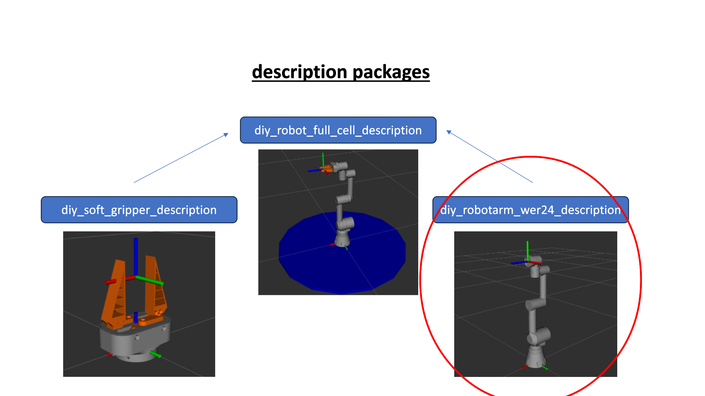
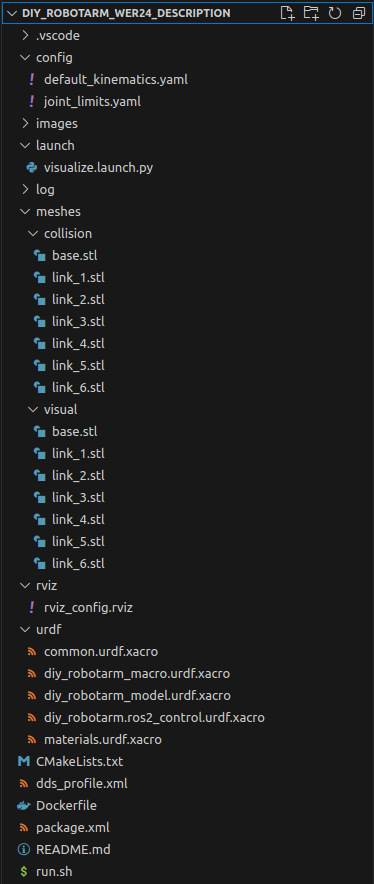
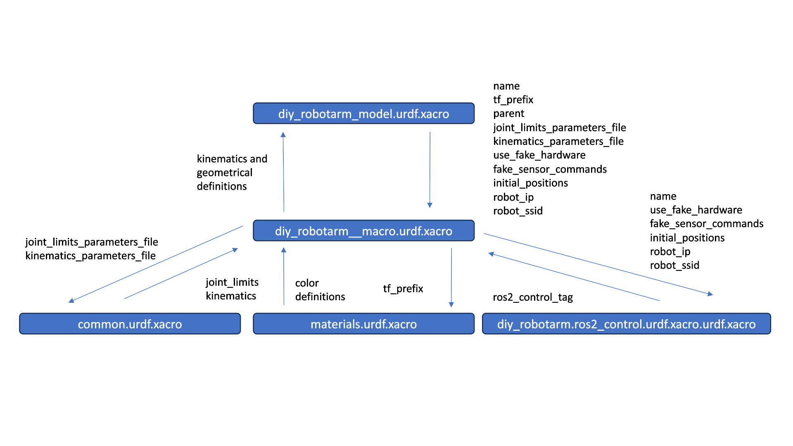
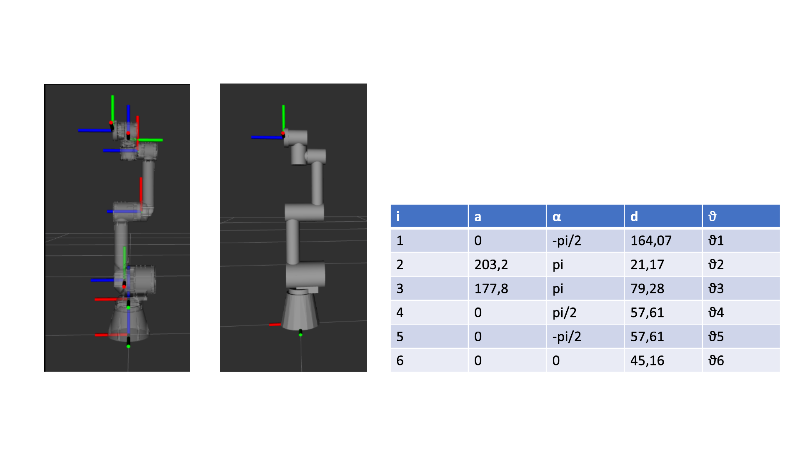

# DIY-RobotArm-WER24-Description

## thematical Classification
This repository contains a ROS2 package for the 3D-printed robot arm, designed by LOBOCNC and published on Printables (https://www.printables.com/model/132260-we-r24-six-axis-robot-arm and https://www.printables.com/model/132262-robot-actuators)
We use this ur-3 copy as a base modified for our purposes. For a full description of the hardware-build process please refert to the DIY-Robotics-Hardware repo.

The main idea is, that this repo can be cloned inside a docker-container containing and combining all description packages for the whole scene (e.g. Base, Robot, Gripper, additional obstacles) Using differnet docker containers is very likely, because this makes the whole integration very modular.

Refer to the main Readme.md [https://github.com/mathias31415/diy_robotics/blob/main/ROS-Packages/ROS-OVERVIEW.md ](https://github.com/mathias31415/diy_robotics/blob/main/ROS-Packages/README.md) for a general overview.



## Package Structure



 - images and README.md are only for docomentation purposes
 - Dockerfile, run.sh and dds_profile.xml are used to create the docker container where ROS is running in
 - CMakeLists.txt and package.xml are defining this build process (wich dependencies are needed, which file should be installed where in the created directories, ...)
 - meshes, rviz, urdf, config and launch are the directories which are containing the source files for this package, they will be described in the following

## URDF Definition

For this URDF definition we use the ROS xacro extention to ensure clear structures and the best modularity. If you want to know ho to define a URDF-model please refer to our gripper description repo: https://github.com/RobinWolf/diy_soft_gripper_description 
In addition to the xacro sub-urdf definitions we have implemented the usage of several confuguration files in the "config" directory.

On the one side there is the default_kinematics.yaml file which contains all of the kinematical properties (position and orientation of the joints, xyz and rpy) and on the other side there is the joint_limits.yaml which contains joint limits (position, velocity, acceleration and effort). Don't be surprised why all joints are specified with position limits of +/-pi, that are not our real motion limits. We have decided to define position limits on the ESP32 hardware-driver side, which are checked before a new setpoint is set. So the config file only is taken into account if you are using fake_hardware. If you are using real_hardware, the limits specified on the ESP32 side are taken into account.

The following graphic shows how the full URDF definition of the arm was build and which parameters are passed in between the diffrent macros.


The definition ROS-control inside the description package seems to be a bit weired, but there are no other opportunities to structure that. It's based on an architecture decision by the ROS2-developers which was in my opinion not the best. But now we have to deal with it. If you are currently reading the wohle Readme-Series to the main diy-robotics project, we will come back to this issue in the diy_robotarm_wer24_driver Readme: https://github.com/RobinWolf/diy_robotarm_wer24_driver/blob/main/README.md

The whole CAD robot arm model with its 6 links and 6 joints was CAD-designed in respect to the dernavit-hartenberg convention. This is a common practice to describe kinematics in robotics.
So all exported link-meshes had already their right oriented reference set. That's why we can specify the link origins in equal to the joint origin which connects the specific link to its parent.
The graphic below shows the full kinematic chain of our arm (from world to link_6/ flange) with reference sets in respect to dernavit hartenberg convention.

red = X-axis<br>
green = Y-axis<br>
blue = Z-axis (joint-axis)<br>

On the left hand side the visual-meshes of the robot model are displayed. We also defined a simplified collision geoemtry for collision checking and motion planning. This is shown on the right hand side. All meshes are stored in teh "meshes" directory.




## Launch

By running the launch file ````visualization.launch.py```` automatically when you start the docker container by sourcing the run script ````./run.sh```` you will launch Rviz and the Joint State Publisher GUI. This is only for visualization and checking purposes, because we don't do a real bringup of the robot model. Joint States are just published by the GUI on the specific ROS-topic.

Now you should be able to move the robot arm around in Rviz by sliding the bars of the Joint State Publisher GUI. 
