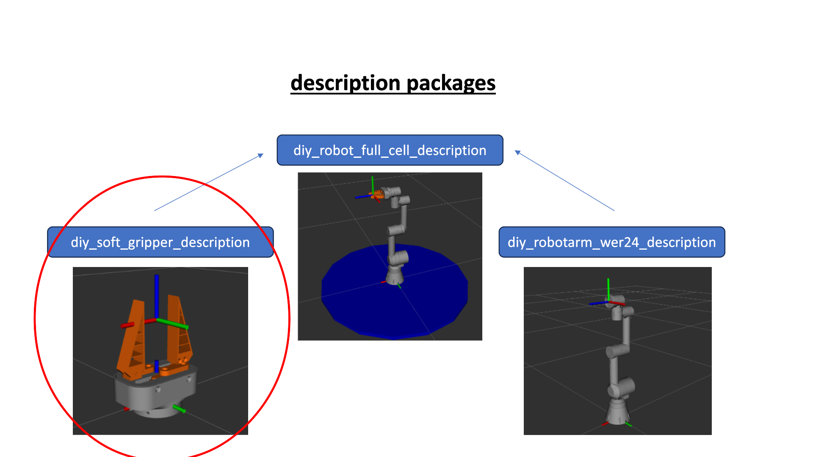
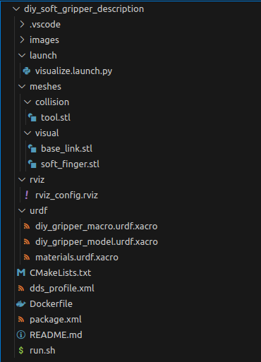
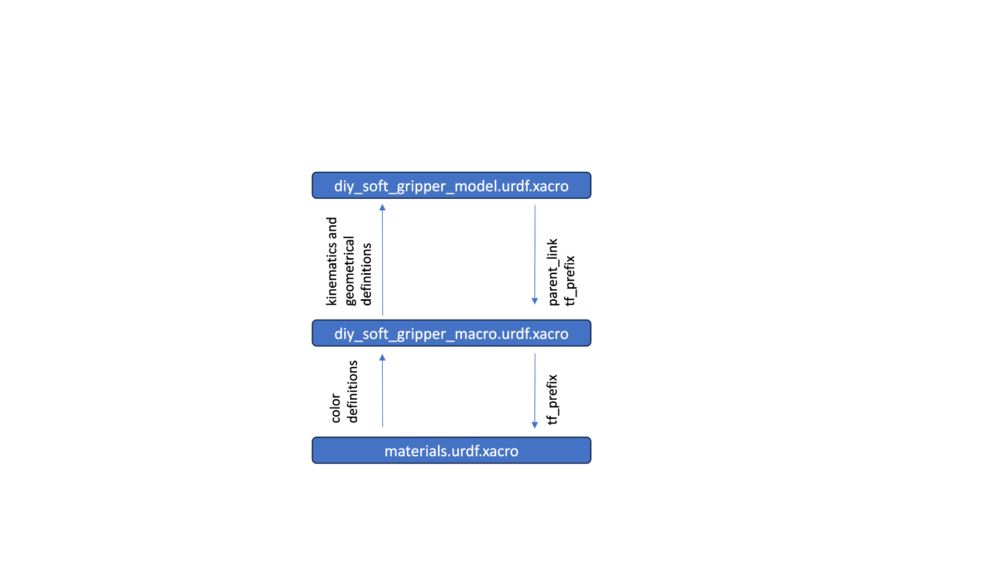
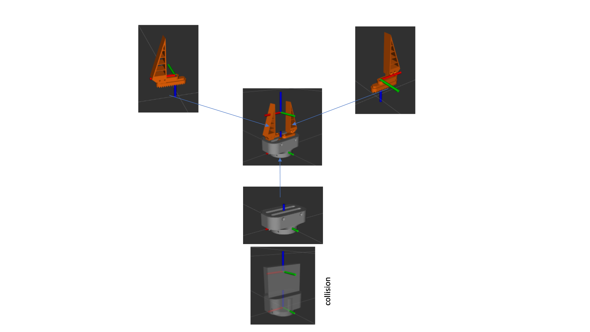

# DIY-SoftGripper

## Thematical Classification
This repository contains a ROS2 package which contains the description files for our developed parallel kinematics gripper with adaptive soft-fingers attached.




The main idea is, that this repo can be cloned inside a docker container containing and combining all description packages for the whole scene (e.g. Base, Robot, Gripper, additional obstacles)
Using differnet docker containers is very likely, because this makes the whole integration very modular. To get further informations about the general structural approach of the ROS integration, please refer to this readme: [https://github.com/mathias31415/diy_robotics/blob/main/ROS-Packages/ROS-OVERVIEW.md](https://github.com/mathias31415/diy_robotics/blob/main/ROS-Packages/README.md)

## Package Structure



- images and README.md are only for docomentation purposes
- Dockerfile, run.sh and dds_profile.xml are used to create the docker container where ROS is running in
- CMakeLists.txt and package.xml are defining this build process (wich dependencies are needed, which file should be installed where in the created directories, ...)
- meshes, rviz, urdf and launch are the directories which are containing the source files for this package, they will be described in the following

## URDF Definition

As mentioned in the main repo, we aimed for a modular structural approach of our ROS integration, so we decided to use the xacro package (must be installed as dependencie). When using xacro, we are able to combine some smaller and clear sub-urdf definitions into one main urdf definition for the gripper.
URDF means unified robotics description format and is an extensible markup language (XML) file type that includes the physical description of a robot or in this case of an gripper.

We structured our gripper-urdf with this approach:



The gripper has 3 different links (one base and the two jaws) which are connected with fixed joints due to simplicity reasons. We decided to this simplified approach for the gripper because on the one hand we have no status feedback from the hardware (open loop control) and on the other hand we only have a two possible states (open and closed). Furthermore our gripper hardware is force-limited and not position controlled. Without a hardware state interface we are not able to determine the current open-width of the gripper jaws, so displaying somenthing what's not proper real doesn't make sence in our opinion.

Let's have a deeper look into the definition of the links and joints. The main kinematic properties are defined in the diy_gripper_macro.urdf.xacro, so we refer to this file.
Definition of the base is given for example:

```xml
<joint name="${tf_prefix}gripper_to_parent" type="fixed">
    <parent link="${parent}"/>
    <child link="${tf_prefix}base_link"/>
</joint>

<link name="${tf_prefix}base_link">
  <visual>
    <origin xyz="0 0 0" rpy="0 0 0" />
    <geometry>
      <mesh filename="package://diy_soft_gripper_description/meshes/visual/base_link.stl" scale="0.001 0.001 0.001"/>
    </geometry>
    <material name="${tf_prefix}grey" />
  </visual>

  <collision>
    <origin xyz="0 0 0.028" rpy="0 0 0" />
    <geometry>
      <mesh filename="package://diy_soft_gripper_description/meshes/collision/tool.stl" scale="0.001 0.001 0.001"/>
    </geometry>
    <material name="${tf_prefix}red" />
  </collision>
</link>
```
Every joint represents a new reference set which is defined in reference to the origin of its parent link. It's a common approach that the origin of the child link equals the reference set of the joint which connects the child link to its parent link, please note that in the given code above.
If you do so, the only way to orient the links and relative to each other is the definition of the joint origin with 3 prismatic degrees of freedom for the position and 3 euler-angles for the orientation. Because we define our joints as "fixed" the definition of a axis can be neglected.

Now we have defined a joint which connects the desired child link to its parent and defines their relative pose.

Let's go on with the definition of our child link. In the link definition we can define the link geometries, intertial properties and materials. Because inertial calculations are way over the top for our diy-project we don't use them. If you don't define some tags, ROS will use common defauls like 1 in the background.
There are multiple ways to define the link geometry, but we will load them from stl-meshes which are exported from our CAD-system. Please make sure that the definition of the CAD-reference sets equals this you need in the URDF definition!
Moreover it's a common approcah to use two seperate geometry definitions for a visual mesh (displayed in rviz) and a collision mesh (used for collision-checking and motion planning). The collision meshes are strongly simplified versions of the real (visual) geometry, this will save computing power and runtime when operating the robot.
In common you define a visual and a collision mesh for every link, but our gripper consists only of fixed links we decided to load only one collision mesh for all three links. That's why you won't find collision properties in the jaw-links.

For further convenience we add an additional TCP-Link without any geomatry. That gives us the opportunity to program trajectories for the TCP in the application later.
The following graphic shuold clarify our URDF definition at all:




## Launch Files and parametrized Values
To run the package inside a docker container, you just have to navigate in terminal to the ```` ./run.sh```` script and source it. This will automatically build and source your ROS Workspace and launch Rviz for visualization purposes.

This practice will launch Rviz with the saved configuration (rviz_config.rviz) and default Launch Argument for tf_prefix. You now should see the visualization of your URDF definition "diy_soft_gripper_model.urdf.xacro".
