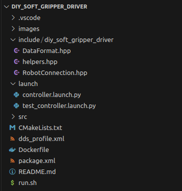
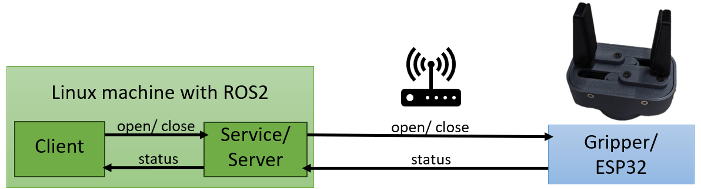

# diy_soft_gripper_driver

## Thematical Classification
This ROS2 package contains the driver for the gripper of our DIY-Robot. This driver will be the interface between ROS (running in Docker containers on your LINUX machine) and the hardware (task running on an ESP32 which controls the gripper). The connection will be established via network (so the gripper/ESP has an IP Address which ROS is talking to via TCP/IP Protocol).

We use Docker for development (dev branch) and deployment (main branch) to avoid version and dependency issues. To run the package, you just have to source the run.sh script file. The container will start and you can work with the provided package, modify it, or include it as a dependency to another package!

Refer to the [overview README.md of the ROS-Packages]([ROS-Packages/README.md](https://github.com/mathias31415/diy_robotics/blob/main/ROS-Packages/README.md)) for a general overview.

## Package Structure

- images and README.md are only for documentation purposes
- Dockerfile, run.sh, and dds_profile.xml are used to create the Docker container where ROS is running in
- CMakeLists.txt and package.xml are defining this build process (which dependencies are needed, which file should be installed where in the created directories, ...)
- include, src, and launch are the directories which are containing the source files for this package, they will be described in the following

## Package Description
This package contains a simple ROS 2 service and client for controlling a gripper on a robot. The service allows the gripper to be opened or closed based on the provided command (0 for open, 1 for close).

### Service (Server) - GripperControlServer
The gripper control server (GripperControlServer) is a ROS 2 node responsible for establishing a connection with the gripper and providing a service to open or close the gripper. The data format for communication between the ESP and ROS is defined in the `DataFormat.hpp` file.

### Client - GripperControlClient
The gripper control client (GripperControlClient) is a command-line tool for interacting with the gripper control service. It sends a request to the server to open or close the gripper based on the provided command-line argument (0 for open, 1 for close).

## Helpful commands for using the service server and client:
### Build Docker Container and ROS2 package
1. Navigate to the ros2_ws with `cd`
2. `./run_dev.sh`
3. `colcon build`
4. `source install/setup.bash`

### Start nodes with ros2 run ...
5. `ros2 run diy_soft_gripper_driver server <IP-Address> <Port>` (e.g.: `ros2 run diy_soft_gripper_driver server 192.168.212.202 80`)
6. Open a second terminal
7. `docker ps` --> find out the ID of the Docker container  
8. `docker exec -it <Container ID> bash` 
9. `ros2 run diy_soft_gripper_driver client <0 to open, 1 to close the gripper>`

### Or start nodes with launch file
5. `ros2 launch diy_soft_gripper_driver controller.launch.py`
