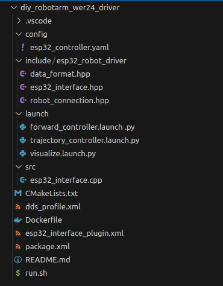
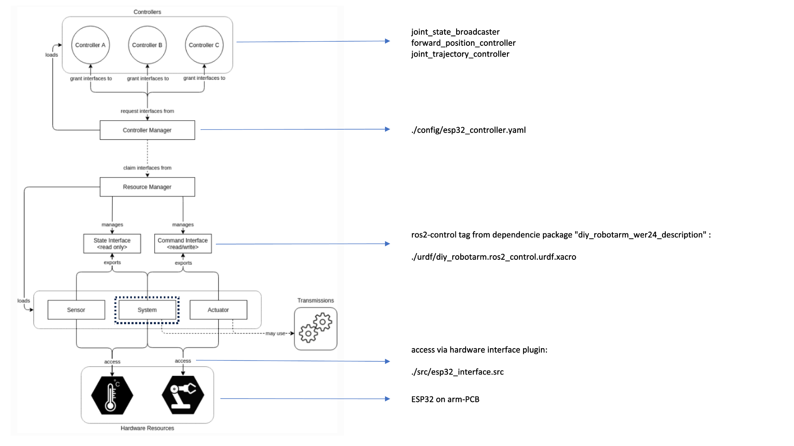

# diy_robotarm_wer24_driver

## thematical Classification

This ROS2 package contains the driver for our DIY-Robot.
This driver will be the interface between ROS (ruinning in docker containers on your LINUX machine) and the hardware (task running on an ESP32 which controlls the robot axis by DRV8825 stepper drivers).
The connection will be established via network (so the robot/esp has an IP Adress which ROS is talking to via TCP/IP Protocol).

We use Docker for development (dev branch) and deployment (main branch) to avoid version and dependencies issues.
While building the container the depencencie-reops for the robotarm and gripper are cloned from GitHub and setup automated.
To run the package, you just have to source the run.sh script file. The container will start and you can work with the provided package, modify it or include it as an dependencie to another packages!

The main idea is, that this repo can be cloned inside a docker-container containing and combining all packages for operationg the Robot (e.g. description, drivers, moveit2, applivation) Using differnet docker containers is very likely, because this makes the whole integration very modular.

This driver package needs the whole description package (diy_robot_full_cell_description) already running in an container, so we need **Part 1, description** as a dependencie package already build and sourced inside this container (````/home/$USER/dependencies/...````)

Refer to the main Readme.md https://github.com/mathias31415/diy_robotics/blob/main/ROS-Packages/README.md for a general overview.


## Package Structure



 - images and README.md are only for docomentation purposes
 - Dockerfile, run.sh and dds_profile.xml are used to create the docker container where ROS is running in
 - CMakeLists.txt and package.xml are defining this build process (wich dependencies are needed, which file should be installed where in the created directories, ...)
 - config, include, src and launch are the directories which are containing the source files for this package, they will be described in the following

## Short Introduction into ROS2 Control

ROS 2 Control is a framework for controlling robotic systems in the Robot Operating System 2 (ROS 2) ecosystem. It provides a modular and flexible architecture for interfacing with various hardware components, such as motors and sensors. This framework enables developers to design and implement control algorithms for a wide range of robotic platforms. ROS 2 Control offers standardized interfaces for hardware abstraction and device drivers, facilitating interoperability across different robotic systems. It supports both position and velocity control, as well as efforts to accommodate diverse robotic applications and control strategies.

In our case we will implement a hardware interface to our diy-hardware which will be position-controlled. Moureover we will define two controllers. On the one hand a ````forward_command_controller/ForwardCommandController```` which is used only for testing purposes and on the other hand a ````joint_trajectory_controller/JointTrajectoryController```` which will be used by moveit2.

The following graphics gives you a short overview about the ROS2-control architecture (source: https://control.ros.org/humble/doc/getting_started/getting_started.html):



The hardware innterface plugin is called in the dependencie package "diy_robotarm_wer24_description" ````./urdf/diy_robotarm.ros2_control.urdf.xacro```` with ```` <plugin>esp32_robot_driver/ESP32Hardware</plugin>````. For more informations about generating a ROS2 control tag for real hatdware or for fake hardware please refer to this repo (we mentioned this bit weired ros2 architecture there as well): https://github.com/RobinWolf/diy_robotarm_wer24_description

## Definition of the Controller Manager and the Controller Interfaces

The controller manager and the controller interfaces itself are defined in ````./config/esp32_controller.yaml````. 

### Definition of the Controller Manager:
```yaml
controller_manager:
  ros__parameters:
    update_rate: 50  
    joint_state_broadcaster: 
      type: joint_state_broadcaster/JointStateBroadcaster 
    forward_position_controller: 
      type: forward_command_controller/ForwardCommandController
    joint_trajectory_controller: 
      type: joint_trajectory_controller/JointTrajectoryController
````
- the update_rate defines the frequency (Hz) of the realtime control loop reading and writing messages to or from the robot.
- the joint_state_broadcaster takes take the joint state information provided by the joint state publisher and broadcasting it on /joint_states topic
- the forward_position_controller passes command signal to every joint (controls all joints dependent to each of them) --> used by moveit
- the joint_trajectory_controller passes command signal from the command topic down to single joints. Command signal and joint hardware interface are of the same type (position/ angle)

### Definition of the joint_trajectory_controller:

The forward_position_controller os defined the same, but only passing the joints and interface parameter, we will explain the trajectory controller only because this is more complex and usesd in the final application.
````yaml
joint_trajectory_controller:
  ros__parameters:
    joints:
      - "arm_shoulder"
      - "arm_upper_arm"
      - "arm_forearm"
      - "arm_wrist_1"
      - "arm_wrist_2"
      - "arm_wrist_3"
    command_interfaces:
      - position
    state_interfaces:
      - position
    state_publish_rate: 100.0
    action_monitor_rate: 20.0 
    allow_partial_joints_goal: false
    open_loop_control: true
    allow_integration_in_goal_trajectories: true
    constraints:
      stopped_velocity_tolerance: 0.01
      goal_time: 0.0
````
- First we define the names of the joints and joint interfaces the controller should get connected to by the controller manager, as mentioned below they must match the definitions in the ````/home/$USER/dependencies/diy_robotarm_wer24_description/urdf/diy_robotarm.ros2_control.urdf.xacro````.

```xml
 <joint name="${tf_prefix}shoulder">
     <!--define command interface PcToRobot-->
     <command_interface name="position">
         <param name="min">{-pi}</param>
         <param name="max">{pi}</param>
     </command_interface>
         <!--define state interface RobotToPC (NOTE: our Hardware is an open-loop control system!)-->
     <state_interface name="position">
     <!-- initial position for the FakeSystem and simulation -->
         <param name="initial_value">${initial_positions["shoulder"]}</param>
     </state_interface>
 </joint>
  ```

We used a command interface named ````position```` and a state interface also named ````position````. Because we are passing a default parameter ````${tf_prefix}```` for namespace reasons to the joint interface name definition. ````arm_```` in our case (for full parameter description in the urdf files please refer to this readme: https://github.com/RobinWolf/diy_robot_full_cell_description/blob/main/README.md)

Moreover the joint_trajecotry controller is set up with some additional parameters which influence the controller behavoirs.

- The controller works as an action-server ````joint_trajectory_controller/follow_joint_trajectory````, which can called by an action-client (simplyfied you can say the client is moveit). ````state_publish_rate```` and ````action_motitor_rate````define frequencies the controller publishes commands and monitors states on the topics the server is connedted to. We will come back to this later in the moveit repo: https://github.com/RobinWolf/diy_robot_wer24_moveit
- Setting ````open_loop_control = false```` is done because our harware provides a state interface/ monitoring. But be aware of using this because the robot state of our diy hardware belongs on counted steps and not angle measurement. If the steppers loose steps, we will not recognize that !
- The other paramerters define some conatraints for trajectory calculation and execution.

**Note:** <br>
Because we were not able to parametrize the definitions in the controller manager at all, be careful when using other prefixes instaed of the defaults. The defined names match our default launch prefixes, but if you want to modify the prefixes for some reason, make sure to change the joint interface name definitions in the controller definition too!

## Definition of the Hardware Interface Plugin

The hardware interface plugin defines the methods the controller uses while controlling the real robot, so here we implement our harware communication.

- on_init: called when initializing the controller (init variables, declare and initializs node parameters used by the controller such as ````robotConnection.hw_states_axisPositions````)
- on_configure: called after on_init, parameters from ros2_control_urdf.xcacro are read here and passed to the controller ( ````robot_ip````, ````robot_ssid````, ````tf_prefix```` ) export_state_interfaces: called to match the defined state interfaces from the urdf to set them up and registered for communication with the underlying hardware (in our case ````position````)
- export_command_interfaces: called to match the defined commend interfaces from the urdf to set them up and registered for communication with the underlying hardware (in our case ````position````)
- on_activate: called when the realtime control loop gets activated --> interfaces get established/ datatransfer starts. Moreover we set the ````robotConnection.toggleActuatorPower````bool of our message to ````true```` to indicate that the communication to the robot was established sucessfully.
- on_deactivate: called when the realtime control loop gets deactivated --> interfaces get closed and datatransfer stops. Moreover we set the ````robotConnection.toggleActuatorPower````bool of our message to ````false````.
- read: called to read joint states (because oben loop control the previous setpoints) from the hardware --> read control-value (Istwert). The states position array from the incoming message (RobotToPC)````robotConnection.hw_states_axisPositions```` gets read into the ROS ecosystem.
- write: called to send new setpoints to the hardware --> wrire setpoint-value (Sollwert). The next setpoint position array from the ROS2 ecosystem gets written to the outgoing message (PCToRobot) ````robotConnection.hw_cmd_axisPositions````.

The data communication is handled by the methods implemented in the header files ````./include/robot_connection.hpp```` and ````./include/data_format.hpp````. If you are interested in knowing more about the data exchange or the communication setup itself please refer to the ESP32 software repo: https://github.com/mathias31415/diy_robotics/tree/main/diy_robotics_arm_esp32

The plugin gets loaded when you set the launch argument ````use_fake_hardware:=false```` when launching the controller package. You define which plugin you harwdare should use in the ````/home/$USER/dependencies/diy_robotarm_wer24_description/urdf/diy_robotarm.ros2_control.urdf.xacro```` as shown below:

To call the plugin we have to export it first with the pliginlib ROS-extention which makes our ````./src/esp32_interface```` acessable for the ROS2 ecosystem by creating the ````esp32_interface_plugin.xml```` file in our driver workspace:
```xml
<library path="esp32_interface_plugin">
  <class name="esp32_robot_driver/ESP32Hardware"            
         type="esp32_robot_driver::ESP32Hardware"
         base_class_type="hardware_interface::SystemInterface">
    <description>
		ROS2 Control System Driver for DIY Robotic Projects (WIFI Connection to ESP32 on the Hardware-Side).
    </description>
  </class>
</library>
```
Now we can access the plugin named ````esp32_robot_driver/ESP32Hardware```` in the URDF definition (where esp32_robot_driver is the namespace of the interface and ESP32Hardware the class containing the controller methods). We also have to pass all the parameters wee need in our implemented controller methods.

```xml
 <hardware>
     <xacro:if value="${use_fake_hardware}">
        <plugin>mock_components/GenericSystem</plugin>
        <param name="fake_sensor_commands">${fake_sensor_commands}</param>
        <param name="state_following_offset">0.0</param>
     </xacro:if>)
     <!--unless no simulation is required, use real hardware-->
     <xacro:unless value="${use_fake_hardware}">
         <plugin>esp32_robot_driver/ESP32Hardware</plugin>    <!--call our plugin for interfacing with the esp (this is the Driver!)-->
         <param name="robot_ip">${robot_ip}</param>
         <param name="robot_ssid">${robot_ssid}</param>
         <param name="tf_prefix">${tf_prefix}</param>
     </xacro:unless>
 </hardware>
```

## Launch

In contrast to the description packages the launch of the recommendet nodes will not automatically be done while buildung the container, because we have implemented three launch files for three different purposses.

To make these files executable please move to the diy_robotarm_wer24_driver workspace with: ````cd /home/$USER/dependencies/diy_robotarm_wer24_driver_ws/
````and source it with ````source install/setup.bash````. Hint: You have to do this in every new terminal you start and connect to your docker container! Connection of a new terminal with the running container can be done with ````docker ecex -it <name> bash```` , in our case name = ````robot_arm_driver```` for this development stage.

- ````viszualize.launch.py````: This is only for visualization and checking purposes of the description packages in the dependencies-directory, because we don't do a real bringup of the robot model. Joint States are just published by the GUI on the specific ROS-topic, we don't launch our drivers!
- ````forward_controller.launch.py````: This is only for testing purposes of our hardware interface. This launch file will launch the **forward_position_controller** only. By passing the launch argument ````use_fake_hardware:=false robot_ip:=<your ip>````in launch, the driver trys to connect to the real robot hardware. Now we have done a real bringup of the robot and you should be able to control the robot by publishing position commands on this topic: ````ros2 topic pub /forward_position_controller/commands std_msgs/msg/Float64MultiArray "{data: [0.0, 0.0, 0.0, 0.0, 0.0, 0.0]}"````. In the data array you can pass any float value between +/- pi, this equals the absolute target joint position in radiants.
- ````trajectory_controller.launch.py````: This launch file gets called in the final application and launches the **trajectory_controller** only. Moveit uses this controller to send the calculated trajectories to the robot. A trajectory consists of waypoint positions and timestamps. Here we do a real bringup of the robot too.

If you notice a log-message like this in your terminal you run the controller you are sucessfully connected to the robot: ````[ros2_control_node-1] [INFO] [1708697874.866430796] [ESP32_Driver]: Successfully connected to the Robot via TCP-IP! ````

**Note:** <br>
Every joint interface defined in the ````/home/$USER/dependencies/diy_robotarm_wer24_description/urdf/diy_robotarm.ros2_control.urdf.xacro```` can only be linked to one single controller interface defined in the ````./config/esp32_controller.yaml````. So make sure you don't launch a controller twice or launch the forward_position_controller and the trajectory_controller at the same time!


